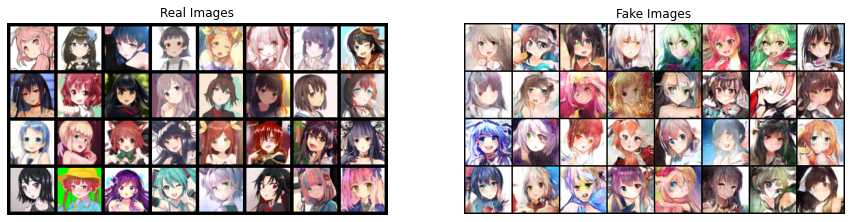
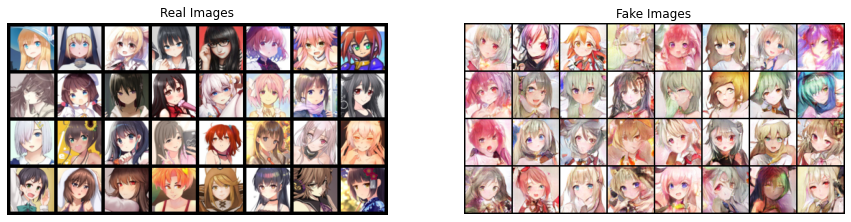
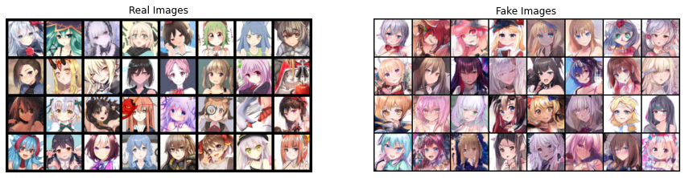

# GANime
Repository for the project of Vision and Perception about a GAN that generates anime faces.

## Visual Results
Here we will show you the images generated by our architecture.
### Baseline

### RESdcgan with CycleGan constraint:

### Best results: RESdcgan 100 epoches

Now we can see how performs the SRGAN and how our best results change in super resolution.

### SRGAN

| Low Resolution | Original High Resolution | Generated Super Resolution |
| ------- | ----------------- | ------------------- |
|  |  |  |
|  |  | 

| generated batches |     |
| ----------------- | --- |
| Low Resolution |  |
| Super Resolution |  |
| Low resolution |  |
| Super Resolution |  |

<!-- <td colspan=2>Second example</td>-->

## Instructions to run the code
To visualize the results obtained by our architecture you can just run the testing.ipynb file (the pretrained models "last_saved_model_100_good.tar" and "netG_epoch_5_smallData.pth" are available in the releases), that will generate a grid of 4 images and then passes it to the srgan to enhance the resolution; the outputs are visible in the file yet.
If, instead, one wants to run the training from scratch, than it is possible to do it running each one of the different architectures that are in this git (each one indipendent from others). To do that it is needed to download the datasets available on Kaggle.

## Dataset
Since our goal is to generate drawn and colored faces in an updated anime style, we searched and found a dataset that met our exception on Kaggle.com (https://www.kaggle.com/datasets/scribbless/another-anime-face-dataset). This dataset contains 92,219 images of size 256x256 and take examples from different works and different authors. This examples are mainly composed by female anime faces, so our architecture is biased to generate female anime faces.
Another dataset was used to train the SRGAN, available on Kaggle as well (https://www.kaggle.com/datasets/lukexng/animefaces-512x512), it contains 140,000 images of size 512x512. In the implementation this dataset was splitted in different folders, to lighten the training. The anime_face folder contains 88,140 files, the dev_anime_face contains 3,824 files and the small_data contains 1,096 files.

## Baseline: DCGAN
We started our architecture from a simple **D**eep **C**onvlutional **G**enerative **A**dversarial **N**etwork.
Our goal was to explore different variation of this architecture, trying to enhance performances reaching good-looking results.

## RESdcgan
The first modification was on the models. We changed the generator (mainly) and the discriminator adding Residual blocks.
We built different version of them and tried different combination to find the best one.
Some combination did not give good results, on the contrary they diminished the performance leading to divergence (noisy results).
Others, instead, enhanced greatly the performance of the network, at the cost of some computational time.

## Checkpoints
At some point of our work we thought that if we want to generate some really good images, we needed to train our architecture for long time, because we had limits on our computational power, in fact all the architectures were trained on a single GPU (NVIDIA RTX 3060 laptop).
So we added checkpoints to store our progresses and keep the training from the point we stopped the last time.
Thanks to this we were able to train the architecture for 100 epochs.

## FID metric for Anime Images
We also wanted an objective metric to evaluate our progresses, so we implemented FID.
However, the original FID was based on the Inception V3 model, that does not work very well on illustration, paintings et similia.
So we used the Illustration2Vec pre-trained model ("illust2vec_ver200.caffemodel", available at https://github.com/rezoo/illustration2vec) as feature extractor and then computed the FID.

## CYCLEGAN constraint
The Cycle GAN constraint consists in force the output of the model to be equal to the input.
In our case we modified the lambda constant to a lower value in order to force the output just to be similar to the input, not equal.

## WGAN
The Wassertein Distance is useful to make the training more stable (mitigating or avoiding the mode collapse).

## SRGAN
At the end we wanted to add this other architecture to enhance the resolution of our images, from 64x64 to 512x512. For this part we took inspiration from https://github.com/goldhuang/SRGAN-PyTorch

## STYLEGAN3
This is the state of the art architecture. We wanted to try it and compare it to ours. The original code is available at https://github.com/NVlabs/stylegan3

# Authors
[Luca Corvitto](https://github.com/LucaCorvitto)

[Lorenzo Faiella](https://github.com/FiscalTax)
